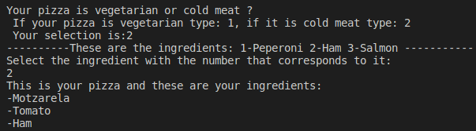
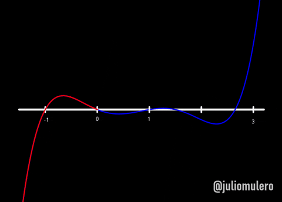

<h1 align="center",>
Welcome to unit two folder: Control structures and cycles
</h1>
<div align = "center">

</div>

 ## Index:  
<center>

[[Exercise 1]](https://github.com/UP210671/UP210671_CPP/tree/main/U2#exercise-1program-that-asks-the-user-for-their-annual-income-and-shows-on-the-screen-the-corresponding-tax) <----- [\CODE/](./Ejercicio1.cpp)

[[Exercise 2]](https://github.com/UP210671/UP210671_CPP/tree/main/U2#exercise-2program-for-calculating-a-bonus-based-on-an-employee-evaluation) <----- [\CODE/](./Ejercicio2.cpp)

[[Exercise 3]](https://github.com/UP210671/UP210671_CPP/tree/main/U2#exercise-3game-center-customer-price) <----- [\CODE/](./Ejercicio3.cpp)

[[Exercise 4]](https://github.com/UP210671/UP210671_CPP/tree/main/U2#exercise-4vegetarian-pizza-ingredient-selection) <----- [\CODE/](./Ejercicio4.cpp)

[[Exercise 5]](https://github.com/UP210671/UP210671_CPP/tree/main/U2#exercise-5average-temperature-maxium-and-minium-value) <----- [\CODE/](./Ejercicio5.cpp)

[[Exercise 6]](https://github.com/UP210671/UP210671_CPP/tree/main/U2#exercise-6products-selling-totals) <----- [\CODE/](./Ejercicio6.cpp)

[[Exercise 7]](https://github.com/UP210671/UP210671_CPP/tree/main/U2#exercise-7decimal-number-to-binary-value) <----- [\CODE/](./Ejercicio7.cpp)

[[Exercise 8]](https://github.com/UP210671/UP210671_CPP/tree/main/U2#exercise-8product-of-a-number-done-x-times-in-a-table-format) <----- [\CODE/](./Ejercicio8.cpp)

[[Exercise 9]](https://github.com/UP210671/UP210671_CPP/tree/main/U2#exercise-9find-the-root-in-a-graph-using-the-bisection-method) <----- [\CODE/](./Ejercicio9.cpp)

</center>
<h1>
</h1>
<center> <h2>Exercise 1.Program that asks the user for their annual income and shows on the screen the corresponding tax</h2></center>
<div align = "center"></div>
 <H1><span style="color:green">INPUT</span>

</h1>

 ```c++
    cout<<"What is your annual income?"<<endl;
    cin>>R;
 ```
<H1><span style="color:purple">PROCESS</span>
</h1>

```c++
if(R<=10000){
        cout<<"Your percentage to pay is: 5%"<<endl;
        I=R*.5;
        cout<<"Your tax to pay is: "<<I<<"\n\n";
    }
    if(R>10000){
        cout<<"Your percentage to pay is: 15%"<<endl;
        I=R*.15;
        cout<<"Your tax to pay is: "<<I<<"\n\n";
    }
    if(R>=20000){
        cout<<"Your percentage to pay is: 20%"<<endl;
        I=R*.20;
        cout<<"Your tax to pay is: "<<I<<"\n\n";
    }
    if(R>=35000){
        cout<<"Your percentage to pay is: 30%"<<endl;
        I=R*.30;
        cout<<"Your tax to pay is: "<<I<<"\n\n";
    }
    if(R>=60000){
        cout<<"Your percentage to pay is: 45%"<<endl;
        I=R*.45;
        cout<<"Your tax to pay is: "<<I<<"\n\n";
```
<H1><span style="color:red">OUTPUT</span>
</h1>

```C++  
        cout<<"Your percentage to pay is: n%"<<endl;
        cout<<"Your tax to pay is: "<<I<<"\n\n";
```
<H1><span style=color:#93EDC3>EXPLANATION</span>
</h1>

```C++
This program is about applying a tax to an annual rent based on the rent value:
RENT VALUE | TAX(%)
60000 | 45%
35000 | 30%
20000 | 20%
10000 | 15%
+0 | 5%
The program works this way:

1.- Ask the user to write their annual rent.
2.- The user types in their annual rent.
3.- Through the use of if , verify that the user typed in a valid number in the rent.
4.- If the user types in a wrong number, don't run the program.
5.- If the user types in a valid number proceed with the main if function:
- Check the data value and run it through a bunch of if and if else in descending order.
-  If the value is bigger than 60000, multiply the tax value by .45 to symbolise that the tax is 45%. If the value is bigger than 35000, apply a tax of 30% by multiplying it by .30 and so on.
6.- Print out the rent the user initially pays, the tax to pay, the your porcentage to pay.
7.- Use Return 0 to check if the program is running correctly.
```

<H1><span style=color:BROWN>TEST</span>

    1. "9999"
<div align = "center">

</div>

    2. "10001"
<div align = "center">

</div>

    3. 20000
<div align = "center">

</div>

    4. 35000
<div align = "center">

</div>

    5. 60000
<div align = "center">

</div>

<h4 align="center">

[[RETURN TO MENU]](https://github.com/UP210671/UP210671_CPP/blob/main/README.md#up210671_cpp) [[RETURN TO INDEX]](https://github.com/UP210671/UP210671_CPP/tree/main/U2#index)
</h2>
<h1>
</h1>
<center> <h2>Exercise 2.Program for calculating a bonus based on an employee evaluation</h2> </center>
 <H1><span style="color:green">INPUT</span>
</h1>

 ```c++
 cout<<"¿What is your calification?"<<endl;
    cin>>c;
``` 
<H1><span style="color:purple">PROCESS</span>
</h1>

```c++
if ((c == 0)||(c == 0.4)||(c >= 0.6 && c <= 1)){
        if (c ==0 ){
            cout << "----------Unacceptable----------"<<endl;
        }
        else if (c == 0.4){
            cout << "----------Acceptable----------"<<endl;
        }
        else if (c >= 0.6 && c <= 1){
            cout << "----------Meritorious----------"<<endl;
        }
```
<H1><span style="color:red">OUTPUT</span>
</h1>

```c++
cout << "Your bonus is: $" << 2400*c<<endl;
        }
        else {
            cout << "----------Invalid rating----------"<<endl;
```
<H1><span style=color:#93EDC3>EXPLANATION</span>
</h1>

\
Employees are rated based on their work perfomance; this program is about giving the employees their deserved bonus based on their performance on different scalings; however, the rating must be 0.0, 0.4 or greater than 0.6, any other value is invalid. The bonus is a percentage equal to their performance where 100% percent is $2400 and 0% is $0. The program works this way:

 * Ask the user about their qualification on a scale on 0 to 1 (Where 1 is 100% and 0 is 0%).
 * If the user types a value other than 0, 0.4 or a number bigger than 0.6, the program does not run and it says that the qualification is invalid.
 * If the user types in a valid value, print out what level the employee has followed up by the bonus percentage and value.
  
<H1><span style=color:BROWN>TEST</span>
</h1>

* Unacceptable
<div align = "center">

</div>

* Acceptable
<div align = "center">

</div>

* Meritorius
<div align = "center">

</div>

* Invalid rating
<div align = "center">

</div>

<div align = "center">

<h1>
</h1>

[[RETURN TO MENU]](https://github.com/UP210671/UP210671_CPP/blob/main/README.md#up210671_cpp) [[RETURN TO INDEX]](https://github.com/UP210671/UP210671_CPP/tree/main/U2#index)
</div>
<h1>
</h1>
<center> <h2>Exercise 3.Game center customer price</h2> </center>
 <H1><span style="color:green">INPUT</span>

 ```c++
 cout<<"How old are you ? ";
 cin>>e;
 ```
<H1><span style="color:purple">PROCESS</span>
</h1>

```c++
if (e>=0){
        if (e>=0 && e<4){
            cout <<"----------Your payment is:  Free----------"<<endl;
        }
        else if (e>=4 && e<=18){
            cout << "----------Your payment is:  $5 pesos----------"<<endl;
        }
        else if (e>18){
            cout << "----------Your payment is  $10 pesos----------"<<endl;
        } 
```
<H1><span style="color:red">OUTPUT</span>

</h1>

```c++
}
        else {
            cout << "----------Invalid rating----------"<<endl;
    return 0;
}
```
<H1><span style=color:#93EDC3>EXPLANATION</span>
  </h1>

  The program is about pricing the entrance for the customer at a game center base on their age:
  

+0 years / FREE PASS 

4-18 years / $5

+18 years / $10

It works the following way:

- Ask the for the customer age.
- Based on the inputted value, declare a value for the price.
- Print out the customer data and price to pay
  - 3.1. If the user typed in an invalid response,print out a error message.
-Return 0 to check that the program ran succesfully.

<H1><span style=color:BROWN>TEST</span>
</h1>

* <3
<div align = "center">

</div>

* 4-18
<div align = "center">

</div>

* +18
<div align = "center">

</div>

* Invalid
<div align = "center">

</div>

<div align = "center">
<h1>
</h1>

[[RETURN TO MENU]](https://github.com/UP210671/UP210671_CPP/blob/main/README.md#up210671_cpp) [[RETURN TO INDEX]](https://github.com/UP210671/UP210671_CPP/tree/main/U2#index)
</div>
<h1>
</h1>
<center> <h2>Exercise 4.Vegetarian pizza ingredient selection</h2> </center>
 <H1><span style="color:green">INPUT</span>
</h1>

 ```c++
 cout<<"Your pizza is vegetarian or cold meat ?\n If your pizza is vegetarian type: 1, if it is cold meat type: 2 \n Your selection is:";
    cin>>p;
``` 
<H1><span style="color:purple">PROCESS</span>
</h1>

```c++
if (p==1){
        if (p==1){
            cout << "----------These are the ingredients: 1-Pepper 2-Tofu----------\nSelect the ingredient with the number that corresponds to it:"<<endl;
            cin>>i;
            if (i==1){
                cout<<"This is your pizza and these are your ingredients: \n-Motzarela\n-Tomato\n-Pepper\n\n\n";
            }
            else if (i==2)
            {
                cout<<"This is your pizza and these are your ingredients: \n-Motzarela\n-Tomato\n-Tofu"<<endl;   
            }       
    }
}
    else {
            cout << "----------These are the ingredients: 1-Peperoni 2-Ham 3-Salmon -----------\nSelect the ingredient with the number that corresponds to it:"<<endl;
            cin>>i;
            if (i==1){
                cout<<"This is your pizza and these are your ingredients: \n-Motzarela\n-Tomato\n-Pepperoni\n\n\n";
            }
            else if (i==2)
            {
                cout<<"This is your pizza and these are your ingredients: \n-Motzarela\n-Tomato\n-Ham"<<endl;
            }
            else if (i==3)
            {
                cout<<"This is your pizza and these are your ingredients: \n-Motzarela\n-Tomato\n-Salmon"<<endl;     
            }
    }
```
<H1><span style="color:red">OUTPUT</span>
</h1>

```c++
cout<<"This is your pizza and these are your ingredients: \n-Motzarela\n-Tomato\n-Salmon"<<endl;
```
<H1><span style=color:#93EDC3>EXPLANATION</span>
</h1>

\
The program asks the user if they'd like a vegetarian pizza at Bella Napoli. Every pizza has the same base ingredients: Mozarrela and Tomate, but an extra ingredient based on if its a vegetarian pizza or not. The extra ingredients are the following :
Tofu and Pepper (Vegetarian), Pepperoni, Ham or Salmon (Non-vegetarian).
The program works the following way:

1. First it ask you if your pizza is vegetarian or meet
   1.1 If your pizza is vegetarian press 1 if not press 2
2. The second step is to choose your ingredients you type the numbers depending on your ingredient
3. Finally, it will tell you how your pizza is and its ingredients
  
<H1><span style=color:BROWN>TEST</span>
</h1>

* Pizza vegetarian = Motzarela, Tomato and Pepper. 
<div align = "center">

</div>

* Pizza vegetarian ) Motzarela, Tomato and Tofu.
<div align = "center">

</div>

* Pizza cold meet = Motzarela, Tomato and Peperoni.
<div align = "center">

</div>

* Pizza cold meet = Motzarela, Tomato and Ham.
<div align = "center">

</div>

* Pizza cold meet = Motzarela, Tomato and Salmon.
<div align = "center">

</div>

<div align = "center">
<h1>
</h1>

[[RETURN TO MENU]](https://github.com/UP210671/UP210671_CPP/blob/main/README.md#up210671_cpp) [[RETURN TO INDEX]](https://github.com/UP210671/UP210671_CPP/tree/main/U2#index)
</div>

<h1>
</h1>
<center> <h2>Exercise 5.Average temperature, maxium and minium value.</h2> </center>
 <H1><span style="color:green">INPUT</span>
</h1>

 ```c++
 cout<<"Give me the temperature: ";
        cin>> temperature;
``` 
<H1><span style="color:purple">PROCESS</span>
</h1>

```c++
if (temperature>=maxtem)
        {
            /* code */
            maxtem=temperature;
        }
        if (temperature<=mintem)
        {
            /* code */
            mintem = temperature;
        }
        contador++;
    }while(contador<6);
```
<H1><span style="color:red">OUTPUT</span>
</h1>

```c++
cout<<"The average of temperature today is: "<<tempAcum/6<<", the lowest temperature is: " <<mintem<<", the hightes temperature is: "<<maxtem<<endl;
```
<H1><span style=color:#93EDC3>EXPLANATION</span>
</h1>

\
The program is about calculating 6 inputs of a temperature value. Each input gains a new etiquette, either max temperature or minium temperature using the previous value as reference. Because of this the default max and minium values use very extreme numbers in order for the first value to aquire the maxium and minium etiquette and keep comparing the following numbers to that initial value.
1. Ask for user input about current temperature 6 times. The value can be a float value.
2. Assign the inputted value as maxium temperature or minium temperature comparing it to the previous value inputted by the user.
3. Calculate the average of the values inputted by the user.
Output the average, minium and maxium value of the 6 inputs.
4. Return 0 to check that the program ran correctly.
  
<H1><span style=color:BROWN>TEST</span>
</h1>

* Pizza vegetarian = Motzarela, Tomato and Pepper. 
<div align = "center">

</div>

<div align = "center">

<h1>
</h1>

[[RETURN TO MENU]](https://github.com/UP210671/UP210671_CPP/blob/main/README.md#up210671_cpp) [[RETURN TO INDEX]](https://github.com/UP210671/UP210671_CPP/tree/main/U2#index)
</div>
<h1>
</h1>
<center> <h2>Exercise 6.Products selling totals.</h2> </center>
 <H1><span style="color:green">INPUT</span>
</h1>

 ```c++
 cout<<"Product "<<numproducto<<"\nAmount: ";
        cin>>amount;
``` 
<H1><span style="color:purple">PROCESS</span>
</h1>

```c++
if (amount<=0)
        {
            /* code */
            cout<<"\n----------Invalid amount,exiting program----------\n";
            break;
        }
        cout<<"Price: ";
        cin>>price;
        if (price<0)
        {
            /* code */
            cout<<"\n----------Invalid amount, exiting program----------\n";
            break;
        }
        numproducto++;
        total += (price * amount);
    } while (price !=0);
```
<H1><span style="color:red">OUTPUT</span>
</h1>

```c++
cout<<"\nYou've inputted a total of "<<numproducto-2 << " 2different products. ";
    cout<<"\nYour total is $"<<total<<" \n\n";        
```
<H1><span style=color:#93EDC3>EXPLANATION</span>
</h1>

\
This program is used to calculate the selling profits of a user. The user inputs and indefinite number of products, the amount that was selled of each product and the price the product was sold at individually. To exit the program the user must input a price of 0. The program also exits when the user writes an invalid product number (0 or less) or an invalid price value (less than 0).

1. Ask the user to write the amount sold of Product X (where X is the times the user has inputted a value)
2. Ask the user to write the price that each individual piece of Product X was sold
3. If the user writes a 0 in the price value, exit the program
4. If the user writes 0 or less in the price or amount value, exit the program
5. Print out the number of products that were inputted
6. Print out the total sum of money profitted.
7. Return 0 to check that the program ran correctly.
  
<H1><span style=color:BROWN>TEST</span>
</h1>

  * Price Valide 
<div align = "center">

</div>
  * Price Invalid 
<div align = "center">

</div>

<div align = "center">

<h1>
</h1>

[[RETURN TO MENU]](https://github.com/UP210671/UP210671_CPP/blob/main/README.md#up210671_cpp) [[RETURN TO INDEX]](https://github.com/UP210671/UP210671_CPP/tree/main/U2#index)
</div>
<h1>
</h1>
<center> <h2>Exercise 7.Decimal number to binary value.</h2> </center>
 <H1><span style="color:green">INPUT</span>
</h1>

 ```c++
 /* code */
    cout<<"Input a decimal number: \n";
    cin>>n;
``` 
<H1><span style="color:purple">PROCESS</span>
</h1>

```c++
if (n >0)
    {
        /* code */
        while (n>0)
        {
            if (n%2==0)
            {
                b='0'+b;
            }
            else
            {
            b='1'+b;
            }
            n/=2;
        }
```
<H1><span style="color:red">OUTPUT</span>
</h1>

```c++
cout << "The number you've inputted is " << b;
            cout << endl;
        }
        else if (n == 0)
        {
            cout << "You've inputted a 0\n";
        }
        else
        {
            cout << "The numer must be greater than 0\n";
        }
```
<H1><span style=color:#93EDC3>EXPLANATION</span>
</h1>

\
The user writes a normal decimal value (it must be a whole number) and the program outputs the number but written in binary.

1. Ask the user to input a value
2. In case the user writes a 0, exit the program
3. In case the user writes a negative number, loop the program
4. If the number written is valid, keep dividing the number by two and keep writing the residue of the division until the number is equal to 0.
5. Print out the string of values done by the formula.
6. Return 0 to check that the program ran correctly
  
<H1><span style=color:BROWN>TEST</span>
</h1>

  * Valid 
<div align = "center">

</div>

* Invalid Input 0
<div align = "center">

</div>

* Invalid Input Negative Number
<div align = "center">

</div>

<div align = "center">

<h1>
</h1>

[[RETURN TO MENU]](https://github.com/UP210671/UP210671_CPP/blob/main/README.md#up210671_cpp) [[RETURN TO INDEX]](https://github.com/UP210671/UP210671_CPP/tree/main/U2#index)
</div>
<h1>
</h1>
<center> <h2>Exercise 8.Product of a number done X times in a table format.</h2> </center>
 <H1><span style="color:green">INPUT</span>
</h1>

 ```c++
cout << "Write a number to multiply by:";
    cin >> n;
``` 
<H1><span style="color:purple">PROCESS</span>
</h1>

```c++
if (c>=0 || c <=0){
    for (int i = 0; i <= c; i++)
    {
        // If and for to print the firts line of -
        if (i == 1)
        {
            for (int f = 0; f <= 41; f++)
            {
                cout << "-";
            }
            cout << "\n";
        }
    
```
<H1><span style="color:red">OUTPUT</span>
</h1>

```c++
// Print the formatted table.
        cout << "|  " << i << "\t x \t" << n << "\t = \t" << (i * n) << "\t |\n";
        
        // For to print line of -
        for (int f = 0; f <= 41; f++)
        {
            cout << "-";
        }
        cout << "\n";
    }
```
<H1><span style=color:#93EDC3>EXPLANATION</span>
</h1>

\
The program asks the user to input a number to be the multiplying factor of the table, it then asks how many times should it do the multiplication scaling 1 to 1 (i.e 1 * X, 2 * X, 3 * X...).

1. Ask the user for the number to multiply the values by.
2. Ask the user how many times should the program run.
3. Using For and /t, make a table format to visualize the results.
4. Return 0 to check that the program ran succesfully.
  
<H1><span style=color:BROWN>TEST</span>
</h1>

  * Valid 
<div align = "center">

</div>

* Negative numbers
<div align = "center">

</div>


<div align = "center">

<h1>
</h1>

[[RETURN TO MENU]](https://github.com/UP210671/UP210671_CPP/blob/main/README.md#up210671_cpp) [[RETURN TO INDEX]](https://github.com/UP210671/UP210671_CPP/tree/main/U2#index)
</div>
<h1>
</h1>
<center> <h2>Exercise 9.Find the root in a graph using the bisection method.</h2> </center>
 <H1><span style="color:green">INPUT</span>
</h1>

 ```c++
cout << "This graph is using the formula x²+x-12 \n";
    cout << "Give me the value of (a)";
    cin >> a;
    cout << "Give me the value of (b)";
    cin >> b;
``` 
<H1><span style="color:purple">PROCESS</span>
</h1>

```c++
    c = (a+b)/2;
    ya = bisection(a);
    yb = bisection(b);
    yc = bisection(c);
    if ((yb * ya < 0) || (ya * yc < 0) || (yc * yb < 0)){
    cout << "| Exercise \t|\t A \t\t|\t B\t\t|\t C \t\t|\t f(A) \t\t\t|\t f(B) \t\t\t|\t f(C) \t\t\t| \n";//Table Header
    for (int i = 0; i < 185; i++)
    {
        cout << "-";
    }
    cout << "\n";
    cout << "| \t" << counter << "\t|\t" << fixed << setprecision(3) << a << "\t\t|\t" << b << "\t\t|\t" << c << "\t\t|\t" << ya << "\t\t\t|\t" << yb << "\t\t\t|\t" << yc << "\t\t\t|\n"; 
    for (int i = 0; i < 185; i++)
    {
        cout << "-";
    }
    cout << "\n";

        while (yc >= 0.01 || yc <= -0.01)
        {
            if ((yc > 0 && ya < 0) || (ya > 0 && yc < 0))//Set up b as the new limit (c) and then c would be the half of the previous value
            {
                b = c;
            }
            else//Same thing but if yb is the opposite sign of yc
            {
                a = c;
            }
            if (a == b)//If point b ends being point b, the cycle would loop infinately, this prevents that
            {
                break;
            }
            
            c = (a+b)/2;
            ya = bisection(a);
            yb = bisection(b);
            yc = bisection(c);
            counter++;
            cout << "| \t" << counter << "\t|\t" << fixed << setprecision(3) << a << "\t\t|\t" << b << "\t\t|\t" << c << "\t\t|\t" << ya << "\t\t\t|\t" << yb << "\t\t\t|\t" << yc << "\t\t\t|\n";
            for (int i = 0; i < 185; i++)
            {
                cout << "-";
            }
            cout << "\n";    
```
<H1><span style="color:red">OUTPUT</span>
</h1>

```c++
cout << "The root is approximately " << setprecision(1) <<  c;
    }
    else //If yb and ya were both the same sign
    {
        cout << "There's no root between the numbers";
    }
    
```
<H1><span style=color:#93EDC3>EXPLANATION</span>
</h1>

\
The program uses a default formula for calculating the root between two numbers; in this case its y=x²+x-12. It first asks the user to input two location in the X axis in the graph, it then determines wheter theres a root between them or not. Afterwards it applies the formula to said inputs and if the results are opposite signs (one is negative and the other positive), there is a root in between them; It then cuts in half the distance between the two points and compares signs with both extremes following the same principle to find out where the root is. Finally, it prints out a table listing all the process it did to find the root and prints out an approximation of where the root is.

1. Ask the user to input a number in the X axis of the graph.
2. Apply the formula to the numbers.
3. If the signs are opposites, there is a root in between.
4. If the signs are the same, there is no root between them.
5. Cut the distance in between the locations in half, check both extremes to see if the signs are opposites again
6. Repeat the process until the formula reaches an approximation to 0-+0.01).
7. Print out the table listing all the process behind calculating the root
8. Print out the root
9. Return an integer (0) because the main function is an integer to check that the program ran succesfully.

<H1><span style=color:BROWN>TEST</span>
</h1>

  * First root 
<div align = "center">

</div>

* Negative numbers
<div align = "center">

</div>


<div align = "center">

<h1>
</h1>

[[RETURN TO MENU]](https://github.com/UP210671/UP210671_CPP/blob/main/README.md#up210671_cpp) [[RETURN TO INDEX]](https://github.com/UP210671/UP210671_CPP/tree/main/U2#index)
</div>