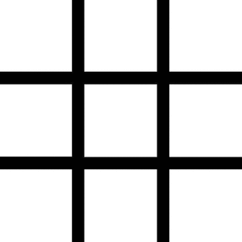
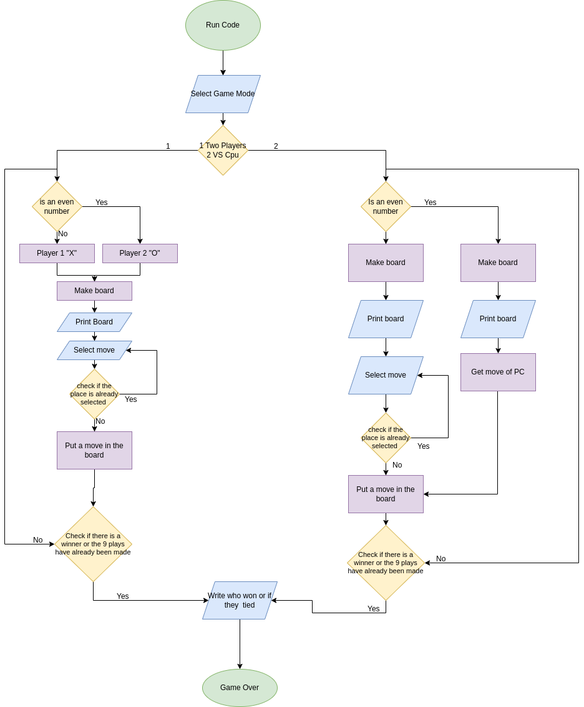

<h1 align="center">
This is the folder of unit three here you can find a game with the theme functions.
</h1>

<h2 align="center">
Welcome to the game of " Tic Tac Toe ". 
</h2>

 ## Index:  

[[ Tic Tac Toe ]](https://github.com/UP210671/UP210671_CPP/tree/main/U3) <----- [\CODE/](./04_Tic_Tac_Toe.cpp)

[[ How to play ]](https://github.com/UP210671/UP210671_CPP/tree/main/U3#how-to-play-) <----- [\CODE/](./Ejercicio2.cpp)

[[ Flowchart ]](https://github.com/UP210671/UP210671_CPP/tree/main/U3#flowchart-)

[[Code execution and explanation]](https://github.com/UP210671/UP210671_CPP/tree/main/U2#exercise-4vegetarian-pizza-ingredient-selection) <----- [\CODE/](./Ejercicio4.cpp)

[[Conclusion]](https://github.com/UP210671/UP210671_CPP/tree/main/U2#exercise-5average-temperature-maxium-and-minium-value) <----- [\CODE/](./Ejercicio5.cpp)

<h1>
</h1>

 <h2>TIC TAC TOE</h2>

<h1></h1>

 <H1 align = "center">HOW TO PLAY
 </H1> 
 

 #### To play, you must first select the game mode since it consists of two players and vs cpu, the two player game mode consists of having someone to play with since each one must take their turn to put their token either an X or an O, the game mode vs CPU consists of a type of codes which lets you play alone, for when you're alone or you don't have someone to play with you can be distracted, at the end of both modes there is a winner.      
#### To win this game there must be a three in a row either three XXX or OOO otherwise it will end in a draw 
<h1></h1>
 

<H1 align = "center">THINGS TO CONSIDER  

## **Both modes:** When selecting any of these two modes you will not be able to choose between being X or O.
## **Mode CPU:** Selecting VS CPU mode will always start the player

</H1>
<h1></h1>
 
<H1 align = "center"> POSSIBLE MISTAKES  

### - Some errors that could happen would be when entering a sign since when entering it the game ends.
### - Another error is when you play against the CPU and it is the CPU's turn and it places it in a box that is already selected. You have to give 4 into for the game to continue and it can happen until someone wins.
### - Possible error not considered: I didn't know whether to take it as an error since when playing vs cpu the cpu is very easy to beat it sounds very silly but it can be related as an error.

</H1>
<h1></h1>
 

<H1 align = "center"> FLOWCHART  

</H1>

 
  

<H1 align = "center"> Code execution and explanation  
</h1>

# 1º Select game mode
Here when the game starts it gives you the option to choose which mode you want to play either **2 players** or **VS CPU**

# 2º Select mode 2 Players
When choosing the 2 player game mode, the name of the game appears, your selected sign, whether you are player 1 or 2, the game board and the move you are going to make

# 3º To play 
Choise your selected number
# 4º How to win
To win you must make either a row, column, diagonal of three of your indicated sign to win

# 5º Game over 

# 6 Select mode VS CPU
If you selected the VS CPU mode you should play by yourself waiting for the computer to put its selected sign and try to beat it and not be tied or lose 

# 7º In case of a tie
The tie is very unusual in the 2 player game mode so in case of a tie it will appear like this